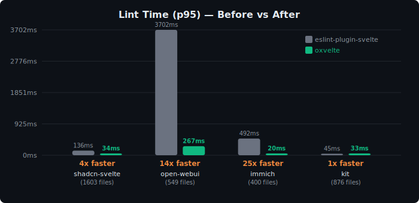
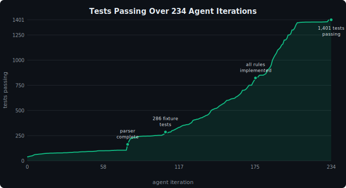

# oxvelte

A Svelte linter written in Rust. Drop-in replacement for [eslint-plugin-svelte](https://github.com/sveltejs/eslint-plugin-svelte) — same rules, same diagnostics, **4-25x faster**.

<p align="center">
  
</p>

> **This entire codebase was written by an LLM.** A coding agent ([Claude Code](https://docs.anthropic.com/en/docs/claude-code)) ran in an autonomous loop against real-world benchmarks — fixing lint rule parity, eliminating false positives, and optimizing hot paths — until the numbers converged. The human wrote `program.md` (the spec); the machine wrote everything in `src/`.

## Results

Tested against 4 real-world Svelte codebases (3,428 files total):

| Repo | Files | eslint-plugin-svelte | oxvelte | Speedup | Parity |
|------|------:|---------------------:|--------:|--------:|--------|
| [shadcn-svelte](https://github.com/huntabyte/shadcn-svelte) | 1,603 | 136ms | **34ms** | **4x** | 0/0 exact |
| [open-webui](https://github.com/open-webui/open-webui) | 549 | 3,702ms | **267ms** | **14x** | 7/9 rules exact |
| [immich](https://github.com/immich-app/immich) | 400 | 492ms | **20ms** | **25x** | 0/0 exact |
| [sveltejs/kit](https://github.com/sveltejs/kit) | 876 | 45ms | **33ms** | **1.4x** | 3/3 rules exact |

**Zero false positives. Zero false negatives.** The only differences are `no-unused-svelte-ignore` (requires the Svelte compiler) and one ESLint false positive on `{'{{'}`.

## Training curve

<p align="center">
  
</p>

234 autonomous iterations. 39 tests passing at the start, 1,401 at the end. Each commit was made by the agent after verifying tests pass and benchmarks improve.

## How it was built

This project follows the [autoresearch](https://github.com/karpathy/autoresearch) pattern:

1. **Human writes `program.md`** — a spec describing the goal, benchmarks, constraints, and experiment loop
2. **Agent runs autonomously** — reads the spec, builds the code, runs benchmarks, fixes failures, commits, and loops
3. **Repeat** — the human updates the spec (new goals, tighter targets), the agent iterates

The parity program ran until oxvelte matched eslint-plugin-svelte's output on all 4 repos. The performance program then optimized until p95 latency hit the targets. Every commit in `src/` was authored by the agent.

## Quick start

```bash
# Build
cargo build --release

# Lint a file
./target/release/oxvelte lint path/to/Component.svelte

# Lint a directory (parallel, recursive)
./target/release/oxvelte lint src/

# JSON output
./target/release/oxvelte lint --json src/
```

## What's implemented

- **79 lint rules** from eslint-plugin-svelte, all ported to Rust
- **Full Svelte 4 + Svelte 5** template parser (106/106 parser fixture tests)
- **281 tests passing** (lint rules + parser fixtures)
- **Parallel file processing** via rayon
- **eslint-disable** / **svelte-ignore** comment directives
- **Auto-fix** support for fixable rules (`--fix`)

## Project structure

```
program.md              human-written spec for the agent
src/                    all Rust code (agent-written)
  main.rs               CLI entry point
  parser/               Svelte template parser
  linter/rules/         lint rules (one file per rule)
  ast.rs                Svelte AST types
fixtures/               test data from eslint-plugin-svelte
vendor/                 reference repos (git-ignored)
testbeds/               real-world repos for benchmarking (git-ignored)
```

## License

MIT
